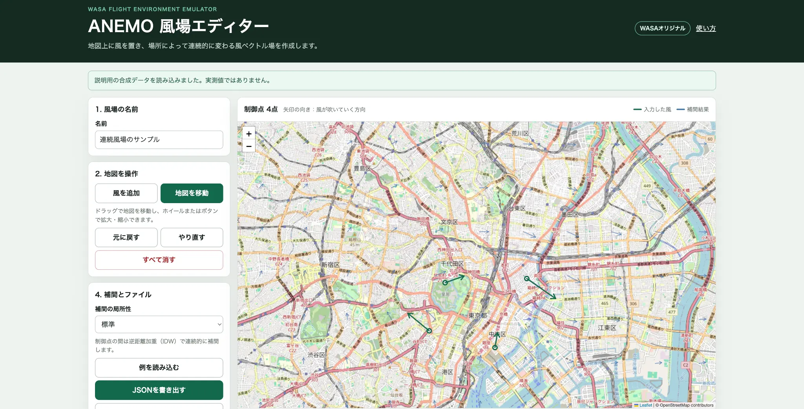

# ANEMO

ANEMOは、風向・風速データの作成、保存、可視化、気象データ取込みを扱うシステムです。地図上で複数の風ベクトルを入力し、場所によって連続的に変化する風場を作成できます。

ANEMOは **WASA Flight Environment Emulator（WASAFEE）が独自に開発しているプロジェクト**です。WASA以外のソフトウェア、地図、気象データ、依存ライブラリには、それぞれの提供者と利用条件があります。

> [!IMPORTANT]
> 初めて使う場合は、[はじめてのセットアップ](docs/getting-started.md)を上から順に実施してください。風場エディターだけならNode.jsで起動でき、PostgreSQLやDockerは不要です。

> [!WARNING]
> このリポジトリは公開されています。パスワード、APIキー、個人情報、WASA内部資料、非公開のFlightEnvironmentEmulatorのコードや機体データをIssue、Pull Request、ログ、設定ファイルへ含めないでください。[公開開発・データ方針](docs/public-development-policy.md)を確認してください。

> [!CAUTION]
> ANEMOが作成・表示する風場は、設計や検討を補助するデータです。実機の安全性、飛行可否、気象状況を単独で保証しません。実機に関わる判断では、実測、公式気象情報、別手法による検証、責任者の確認を行ってください。

## 風場エディターの画面



左側で風場名・地図操作・保存方法を選び、右側の地図で風を配置します。緑色が入力した風、青色が補間結果です。画像は説明用の合成データを表示しています。地図 © OpenStreetMap contributors

## 最短で風場エディターを使う

Node.js 20以上とGitを用意し、次のコマンドを実行します。

```bash
git clone https://github.com/WASAFEE/ANEMO.git
cd ANEMO/wind_generator
npm install
npm start
```

ブラウザで <http://localhost:3000> を開きます。「風を追加」を選び、地図上で風が吹いていく向きへドラッグしてください。終了するときはターミナルで `Ctrl+C` を押します。

詳しい操作、Windowsでのコマンド、保存方法は[はじめてのセットアップ](docs/getting-started.md)と[基本操作](docs/basic-operation.md)にあります。

## 目的から選ぶ

| やりたいこと | 読むページ |
| --- | --- |
| 初めてPCに導入する | [はじめてのセットアップ](docs/getting-started.md) |
| 地図上で風場を作る | [基本操作](docs/basic-operation.md) |
| 何ができるか確認する | [機能一覧](docs/features.md) |
| JSON・CSVの単位と座標系を確認する | [風場データ形式](docs/wind-field-format.md) |
| PostgreSQLへ保存する | [データベース](docs/database.md) |
| 保存済みデータを地図表示する | [`wind_analysis`](wind_analysis/README.md) |
| 気象庁MSMのGRIB2を取り込む | [`batch_gpv_wind`](batch_gpv_wind/README.md) |
| エラーや表示不良を直す | [トラブルシューティング](docs/troubleshooting.md) |
| 構成とデータの流れを理解する | [仕組みとデータの流れ](docs/architecture.md) |
| Issue、ブランチ、Draft PRで開発する | [開発の進め方](docs/development.md) |
| 公開可能な情報を確認する | [公開開発・データ方針](docs/public-development-policy.md) |

すべての説明書は[ドキュメント案内所](docs/README.md)から確認できます。

## 主な機能

- 地図上のドラッグによる風向・風速入力
- 複数制御点からの連続風場プレビュー（逆距離加重補間）
- 制御点の数値編集、削除、元に戻す、やり直し
- ブラウザ内の作業自動保存
- 単位・座標系を明記したANEMO JSONの入出力
- 制御点CSVの書き出し
- 任意のPostgreSQL保存
- PostgreSQLデータのFolium地図表示
- 気象庁MSM GRIB2からの地点風データ抽出

実装済み範囲と制約は[機能一覧](docs/features.md)にまとめています。

## 構成

| ディレクトリ | 役割 | 必須か |
| --- | --- | --- |
| `wind_generator` | 連続風場を作るWebエディターと保存API | 風場作成に必須 |
| `wind_database` | PostgreSQLとFlywayマイグレーション | DB保存時のみ |
| `wind_analysis` | DB内の風をFoliumでHTML地図に変換 | 保存済みデータの分析時のみ |
| `batch_gpv_wind` | MSM GRIB2の取得・抽出・DB保存 | 気象データ取込み時のみ |
| `docs` | 利用・開発・公開方針の説明書 | 参照用 |

Pythonコンポーネントの仮想環境は `uv` で作成し、各 `requirements.txt` から同期します。具体的なコマンドは各コンポーネントのREADMEを参照してください。

## 単位と座標系

- 位置: WGS84の緯度・経度 `[degree]`
- 高度: `[m]`
- 風速: `[m/s]`
- ベクトル: NED（North, East, Down）
- 画面の矢印: 風が**吹いていく向き**
- 方位角: 真北が0°、東が90°、時計回り

気象分野で使われる「風が来る向き」と取り違えないよう、JSONでは `direction_to_deg` とNED成分を保存します。詳細と変換式は[風場データ形式](docs/wind-field-format.md)を参照してください。

## FlightEnvironmentEmulatorとの関係

ANEMO JSONは、FlightEnvironmentEmulator側で扱いやすいNED風ベクトルを保存します。現行のFlightEnvironmentEmulatorにはANEMO JSONの自動読込み機能がまだありません。ANEMOの値を飛行運動へ反映するには、FlightEnvironmentEmulator側で読込み、位置補間、ログ出力、回帰試験を追加する必要があります。

## 開発と連絡

- 標準開発ブランチ: `develop`
- 進め方: [開発の進め方](docs/development.md)
- 不具合・提案: [GitHub Issues](https://github.com/WASAFEE/ANEMO/issues)
- セキュリティ上の連絡: [`SECURITY.md`](SECURITY.md)
- 貢献方法: [`CONTRIBUTING.md`](CONTRIBUTING.md)

## 由来と第三者要素

ANEMOの由来と第三者要素は[`NOTICE.md`](NOTICE.md)にまとめています。Leaflet、OpenStreetMap、Node.js/Pythonパッケージ、気象データの権利や利用条件はANEMOの由来表記とは独立しています。公開状態だけを根拠に、リポジトリ全体へ一律の利用条件が付与されていると判断しないでください。
