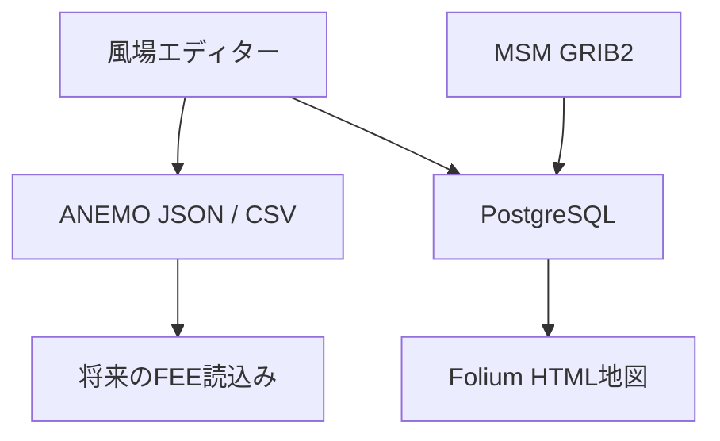

# 仕組みとデータの流れ

ANEMOは、風場作成、データベース、可視化、気象データ取込みを独立したコンポーネントとして管理します。



## コンポーネント

### `wind_generator`

- Express: HTML、CSS、コンパイル済みJavaScript、Leafletの配信
- TypeScriptクライアント: 入力、補間、描画、履歴、ファイル入出力
- PostgreSQL API: 全制御点のトランザクション保存
- DB未設定時: ファイル機能を維持し、保存ボタンを無効化

既定では `127.0.0.1:3000` だけで待ち受けます。外部公開用の認証、TLS、レート制限は実装していません。LANやインターネットへ公開する場合は、用途に合う認証付きリバースプロキシと運用設計が必要です。

### `wind_database`

- PostgreSQL: `weather.wind` テーブル
- Flyway: スキーマとテストデータの版管理
- Docker Compose: ローカルDBとマイグレーション環境

DBポートは既定で `127.0.0.1:5433` にのみ公開します。サンプルのユーザー名とパスワードはローカル開発専用です。

### `wind_analysis`

PostgreSQLから緯度、経度、風向、風速を読み、FoliumのHTML地図を生成します。生成された `wind_map.html` はGit管理対象外です。

### `batch_gpv_wind`

指定日時のMSM GRIB2を外部アーカイブから取得し、指定地点の風向・風速を抽出してPostgreSQLへ保存します。現状は日時、地点、グループIDがコード内にあり、実験機能として扱います。

## エディター内のデータフロー

1. ユーザーが地図上で始点とドラッグベクトルを入力する。
2. 画面差分をNED水平成分 `[m/s]` へ変換する。
3. 制御点配列へ追加し、ブラウザ内の履歴へ直前状態を保存する。
4. IDWで表示格子上のNED成分を計算する。
5. 制御点を緑、補間結果を青の矢印として描画する。
6. 最新状態をlocalStorageへ保存する。
7. ユーザー操作によりJSON、CSV、PostgreSQLへ保存する。

## HTTP API

### `GET /api/health`

サーバーとDBの状態を返します。

```json
{
  "status": "ok",
  "database": "ready",
  "wind_field_schema_version": 1
}
```

`database` は `ready`、`unreachable`、`not_configured` のいずれかです。

### `POST /api/wind-fields`

```json
{
  "measurement_group_id": 123,
  "measured_at": "2026-07-15T00:00:00.000Z",
  "field": {}
}
```

`field` は[ANEMO JSON version 1](wind-field-format.md)です。APIは1 MBまで受け付け、入力を再検証します。全制御点の挿入が成功したときだけコミットします。

### `POST /api/save_wind_data`

旧版クライアント用です。新規実装は `/api/wind-fields` を使用してください。`wind_direction` は真北0°、時計回りの吹いていく向きとして検査します。

## 失敗時の動作

| 失敗 | 動作 |
| --- | --- |
| DB設定なし | エディターを起動し、DB保存だけ無効化 |
| DB停止・通信断 | `unreachable` を表示し、ファイル機能を維持 |
| DB書込み途中の失敗 | トランザクションをロールバック |
| 不正JSON | 読込みを拒否し、現在の風場を維持 |
| 地図タイル取得失敗 | 背景地図が欠ける。制御点とファイル機能は維持 |
| 短すぎるドラッグ | 制御点を追加せず、案内を表示 |
| ブラウザ再読込み | 最新状態をlocalStorageから復元。履歴は初期化 |

## セキュリティ境界

- HTMLへ利用者入力を直接挿入せず、`textContent` を使用する。
- APIはパラメータ化SQLを使用する。
- DBエラーの詳細や接続情報をHTTP応答へ含めない。
- Content Security Policy、`nosniff`、Referrer Policyを付与する。
- 既定のWeb/DB待受けをローカルホストへ限定する。
- `environment/local.json` をGit管理から除外する。

認証と利用者管理は未実装です。公開サーバーとして運用する前に、脅威モデル、認証、TLS、バックアップ、監査ログ、依存更新を設計してください。
