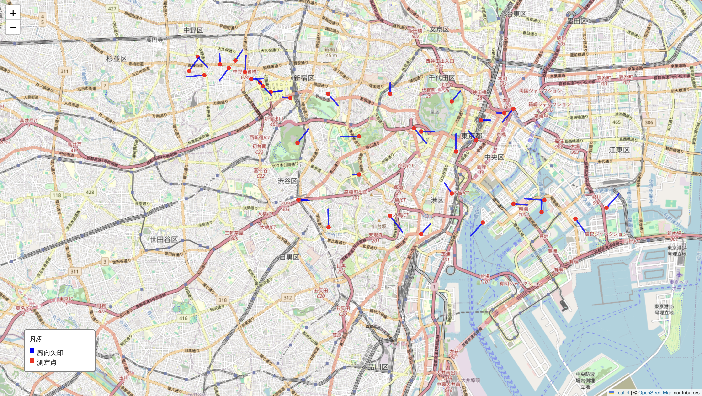

# SQL に保存した風向・風速データを Folium でマップ表示

このドキュメントでは、SQL に保存した風向・風速のデータを Python の**Polars**と**Folium**を使って地図上に矢印表示する方法を紹介します。

## ⓪ PostgreSQL のインストール

```bash
brew install postgresql@14
```

## ① 仮想環境の立ち上げと必要なライブラリのインストール

```bash
cd wind_analysis
source .venv/bin/activate
pip install -r requirements.txt
```

## ② Python による地図表示コード

## ③ 表示結果

コードを実行すると`wind_map.html`というファイルが生成されます。このファイルをブラウザで開くと、次のようなマップが表示されます。

- **赤い丸**が測定した地点
- **青色の線**が風の吹く方向と強さを示しています（矢印が長いほど風が強いことを示します）。



## 備考

- 実際のデータベース接続情報はご自身の環境に合わせて修正してください。
- 表示スケールや矢印のデザインなどは自由に調整可能です。
